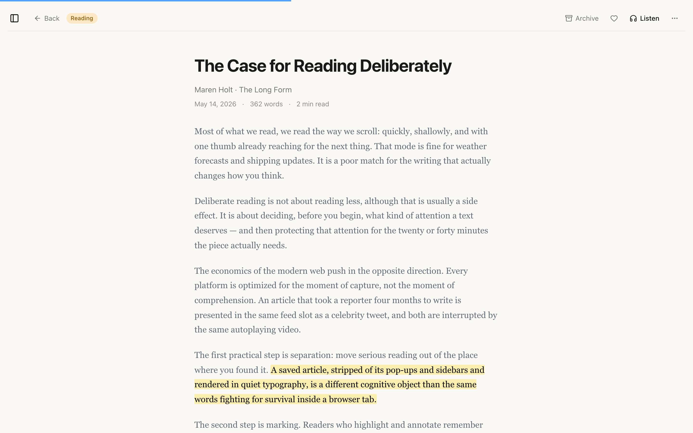
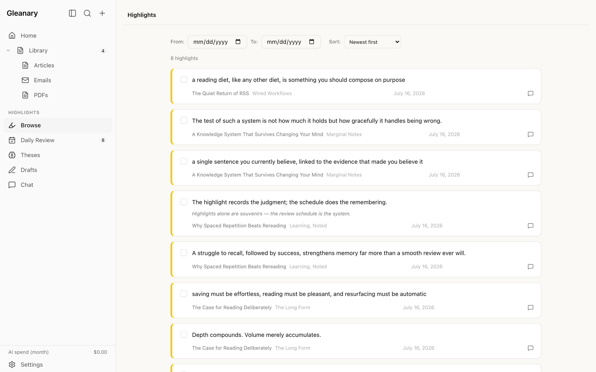
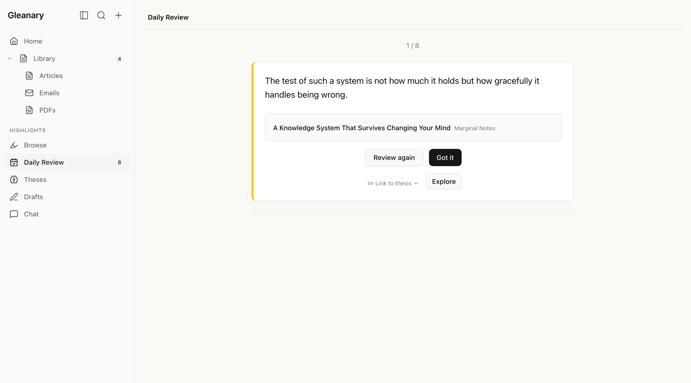

# Gleanary

A self-hosted, single-user read-it-later and highlight management system.
Save articles from anywhere, read them in a clean reader view, highlight what
matters, and let spaced repetition and AI help you actually retain and reuse
what you read.

Built with Next.js, SQLite (Drizzle ORM), TypeScript, Tailwind CSS, and shadcn/ui.
Single container, no external database — your data lives in one SQLite file.

The codebase is built almost entirely by AI coding agents under human review;
[docs/ai-first-development.md](docs/ai-first-development.md) explains the setup.

## Features

- **Save articles** via browser extension, RSS feeds, direct URL, newsletter email (IMAP), or PDF upload
- **Clean reader view** with inline highlighting (select text → highlight)
- **Highlight library** with filtering, bulk operations, and tagging
- **Full-text search** across articles and highlights (SQLite FTS5)
- **Spaced repetition** daily review of highlights (SM-2 algorithm)
- **AI-powered** summarization, explanation, auto-tagging, and knowledge chat (Claude API)
- **Text-to-speech** immersion reading (Inworld)
- **Thesis tracker & drafts** — collect evidence, then turn a thesis into a blog post, LinkedIn post, or YouTube script in your own voice
- **Browser extension** (Chrome/Firefox) for one-click article saving
- **Built-in authentication** — safe to run anywhere; a reverse proxy is only needed for TLS
- **Dark mode** via system preference auto-switch

## Screenshots

Light and dark mode follow your system preference — the images below adapt to
your GitHub theme.

**Reader view** — clean typography, inline highlighting:

<picture>
  <source media="(prefers-color-scheme: dark)" srcset="docs/screenshots/reader-dark.png" />
  
</picture>

**Highlight library** — browse, filter, tag, and bulk-edit every highlight:

<picture>
  <source media="(prefers-color-scheme: dark)" srcset="docs/screenshots/highlight-library-dark.png" />
  
</picture>

**Daily review** — spaced repetition resurfaces your highlights:

<picture>
  <source media="(prefers-color-scheme: dark)" srcset="docs/screenshots/daily-review-dark.png" />
  
</picture>

## Quick Start (Docker Compose)

```bash
git clone https://github.com/gleanary/gleanary.git && cd gleanary
cp .env.example .env
```

Generate the two required secrets and put them in `.env`:

```bash
# SETTINGS_ENCRYPTION_KEY — random 256-bit hex key
openssl rand -hex 32

# SETTINGS_AUTH_HASH — bcrypt hash of your app password
node -e "require('bcryptjs').hash('your-password', 10).then(console.log)"
```

> **Note:** wrap the bcrypt hash in single quotes in `.env`
> (`SETTINGS_AUTH_HASH='$2b$10$...'`) — otherwise dotenv treats each `$` as a
> variable reference and silently corrupts the hash.

Then start the stack:

```bash
# Local / VPN-only (app on http://127.0.0.1:3000)
docker compose -f docker/compose.yml up -d --build

# Public server with HTTPS (Caddy terminates TLS with automatic Let's Encrypt)
DOMAIN=reader.example.com docker compose -f docker/compose.yml --profile tls up -d --build
```

Open the app, log in with the password you hashed above, and configure
optional API keys under **Settings** — they are stored encrypted in SQLite.
Migrations run automatically on container start.

## Configuration

Required (`.env`):

| Variable                  | Description                                                                           |
| ------------------------- | ------------------------------------------------------------------------------------- |
| `DATABASE_URL`            | SQLite path — `file:/data/db/gleanary.db` in Docker, `file:./data/gleanary.db` in dev |
| `SETTINGS_ENCRYPTION_KEY` | AES-256-GCM key (64 hex chars) encrypting stored API keys                             |
| `SETTINGS_AUTH_HASH`      | Bcrypt hash of your app password (login + settings confirmation)                      |

Optional feature keys — set them in the **Settings UI** after first login
(recommended; stored encrypted), or seed them via env vars:

| Feature (paid API)                            | Env var              |
| --------------------------------------------- | -------------------- |
| AI summarize/explain/tag/chat/drafts (Claude) | `ANTHROPIC_API_KEY`  |
| PDF OCR reformat (Mistral)                    | `MISTRAL_API_KEY`    |
| Text-to-speech (Inworld)                      | `INWORLD_API_KEY`    |
| Better article extraction (Jina Reader)       | `JINA_API_KEY`       |
| Readwise import                               | `READWISE_API_TOKEN` |

Newsletter ingestion (IMAP host/user/password) is configured entirely in the
Settings UI. Everything degrades gracefully: features without a key show a
clear "not configured" error instead of breaking the app.

Operational (optional): `BETTERSTACK_SOURCE_TOKEN`, `LOG_LEVEL`, `PORT`,
`REFORMAT_PROVIDER` (AI clean-up provider: `mistral` or `anthropic`),
`PDF_DATA_DIR` (where uploaded PDFs are stored), `APP_BIND` (Docker host bind
address, default `127.0.0.1`), `AUTH_DISABLED` (see Security).

## Security

- **Built-in auth**: every page and API route requires a session (login page)
  or an `Authorization: Basic` header (browser extension, iOS Shortcut). See
  [docs/modules/auth.md](docs/modules/auth.md).
- **HTTPS**: the app itself serves plain HTTP — expose it to the internet only
  behind TLS (the compose `tls` profile ships Caddy with automatic
  Let's Encrypt). On a private network (Tailscale/VPN/LAN) plain HTTP is your
  call.
- **`AUTH_DISABLED=true`** turns authentication off entirely. Only use it when
  the app is reachable exclusively over a private network.
- Report vulnerabilities privately — see [SECURITY.md](SECURITY.md).

## Browser Extension

Load `extension/` as an unpacked extension (Chrome: `chrome://extensions` →
Developer mode → Load unpacked). In its options, set your Gleanary URL and the
app password (username can stay blank). `Alt+Shift+S` saves the current page.

## Mobile Save

- **iOS**: create a Shortcut that opens `https://your-host/save?url=` +
  Shortcut Input, and enable it in the share sheet. Instructions (including a
  silent background variant) are on the `/save` page itself.
- **Android**: install the app as a PWA (Chrome → Install app); it then
  appears in the share sheet.

## Development Setup

```bash
npm install
cp .env.example .env       # set the required values as above
npm run dev                # migrations run automatically first (predev)
```

Requires Node.js 22+. Common commands:

```bash
npm run lint         # ESLint + Prettier check
npm run typecheck    # TypeScript strict check
npm run test         # Unit + integration tests (Vitest)
npm run test:coverage # Same, with coverage report + threshold enforcement
npx playwright test  # E2E tests
npm run db:studio    # Visual DB browser
```

See [docs/development.md](docs/development.md) for the full guide, and
[docs/ai-first-development.md](docs/ai-first-development.md) for the
AI-assisted development workflow this project is built with. Note that
the project does not accept pull requests — bug reports and security reports
are welcome; see [CONTRIBUTING.md](CONTRIBUTING.md).

## Orchestrated Feature Workflow

Non-trivial changes follow the `SESSION: feature` workflow
([`docs/sessions/feature.md`](docs/sessions/feature.md)): plan → test-first
build → secure → simplify → verify → code review. The script at
[`.claude/workflows/feature-session.js`](.claude/workflows/feature-session.js)
runs that session as a **cost-optimized multi-agent orchestration** — the
expensive orchestrator model only plans and reviews, while cheaper subagents do
the implementation and verification.

**Why:** when one model runs the whole session, every file it reads, every test
run, and every review pass piles up in its context and is billed at the top
model's rate. This workflow keeps that work out of the orchestrator's context: a
subagent can burn hundreds of thousands of tokens implementing and verifying,
and the orchestrator only ever ingests its few-KB structured summary. The result
is a large drop in orchestrator token spend for the same rigor and output.

**How it maps to the session** — steps 2–7 run as workers; step 1 and the final
commit stay with the orchestrator:

| Phase     | Worker model            | feature.md step                                    |
| --------- | ----------------------- | -------------------------------------------------- |
| Implement | `opus` / high effort    | 2–4 TEST + BUILD + SECURE (red → green → mutation) |
| Simplify  | `sonnet`                | 5 `/simplify` on changed files                     |
| Polish    | `haiku`                 | prettier + CHANGELOG line                          |
| Verify    | `sonnet` (test-runner)  | 6 full suite, bounded auto-fix loop                |
| Review    | `sonnet` ×3 in parallel | 7 correctness / security / simplification lenses   |

**The boundary the orchestrator keeps for itself:**

- **Before** — write the plan, get human approval (feature.md step 1), then
  launch the workflow with the approved plan passed as `args`.
- **After** — read the returned bundle (review findings, verify status, docs
  impact), make the judgment calls, edit anything workers are barred from
  (`docs/architecture.md`, `.env`, `infra/`, `.github/workflows/`), and commit.

**Running it.** In Claude Code, use the slash commands — each takes a
plain-English brief and drives the whole scout → plan → approve → launch →
review → commit spine for you:

- `/feature <brief>` — a new feature or non-trivial change (test-first mode).
- `/refactor <brief>` — a scoped, behavior-preserving refactor. Runs the same
  workflow in **refactor mode**, which swaps the test-first red/green Implement
  phase for a green-baseline → contract-preservation gate (a refactor has no
  natural failing test; the existing suite plus a byte/shape check is the net).

The command scouts the code, posts a plan for your approval, launches the
workflow on approval, then reviews the bundle and commits. You approve the plan
and answer the occasional question; the build/verify/review work is delegated.
Watch live progress with `/workflows`. (Invoking a command is the explicit
opt-in — without it the orchestrator does the work inline at the top model's
rate.)

Tune the per-phase model, effort, and fan-out cap in the
`MODEL` / `EFFORT` / `MAX_FIX_ATTEMPTS` block at the top of the script.

## Deployment Options

1. **Docker Compose** (recommended) — see Quick Start above. Daily SQLite
   backups are a one-line cron: `sqlite3 data/db/gleanary.db ".backup '...'"`.
2. **OpenTofu on OVH Public Cloud** — the owner's own setup, provided as an
   example in [`infra/`](infra/) (VPS + cloud-init that installs Docker,
   Caddy, backups). Adaptable to any OpenStack provider.
3. **Bare `next start`** — build with `npm run build`, run `npm start` behind
   your own TLS proxy (database migrations run automatically via the
   `prestart` script).

See [docs/architecture.md](docs/architecture.md) for the complete system
architecture.

## Importing PDFs

PDFs are first-class articles with full highlighting, AI features, and a
"View Original" toggle.

**To import a PDF:**

1. Navigate to `/upload` or use the upload icon (↑) in the sidebar
2. Drop a PDF or click to browse — the same drop zone on the home page (`/`) also accepts PDFs
3. After upload, extracted text is displayed in reader view; the original PDF is available via the "View Original" toggle

**Size limits:**

| Limit                  | Value     | Notes                                                              |
| ---------------------- | --------- | ------------------------------------------------------------------ |
| Upload cap             | 50MB      | Enforced client- and server-side                                   |
| AI extraction cap      | 32MB      | Claude document API limit; button is disabled if file exceeds this |
| AI extraction page cap | 200 pages | >100 pages shows a confirmation dialog before extracting           |

**Workaround for oversized PDFs:** compress with Ghostscript (`gs -sDEVICE=pdfwrite -dCompatibilityLevel=1.4 -dPDFSETTINGS=/ebook -o out.pdf in.pdf`), split with `pdftk`, or re-export from the source application at lower DPI (150 DPI grayscale typically halves size for scanned documents).

**Encrypted PDFs** (password-protected) are rejected at upload with a 422 error — no article is created.

## Data Management

### Reset Readwise import

To delete all Readwise-imported articles and highlights and start fresh:

```bash
sqlite3 data/gleanary.db "
DELETE FROM highlights WHERE article_id IN (SELECT id FROM articles WHERE source_id = (SELECT id FROM sources WHERE type = 'readwise'));
DELETE FROM articles WHERE source_id = (SELECT id FROM sources WHERE type = 'readwise');
DELETE FROM settings WHERE key = 'readwise_last_import';
"
```

The next import from Settings will run as a full import.

## License

[PolyForm Noncommercial 1.0.0](LICENSE.md) — free to use, self-host, modify,
and share for any **noncommercial** purpose. Commercial use requires a
separate license from the author; open an issue or contact the maintainer if
you're interested.
